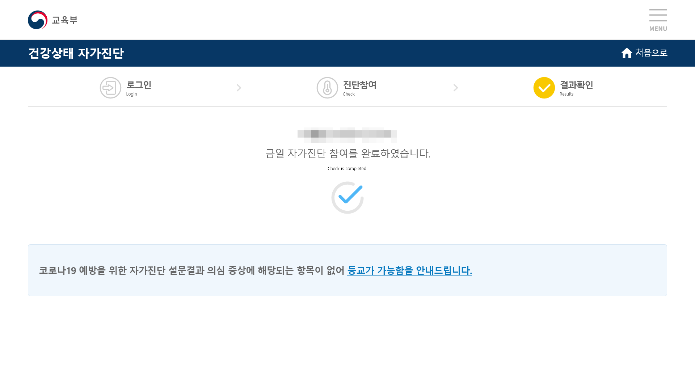

# AUTO SELF DIAGNOSIS
* 자가진단 업그레이드에 대응하여 제작된 프로그램입니다.
* 시작전! config.json을 알맞게 수정하여주세요!
* 정상적으로 작동했다면 screenshot 폴더에 아래의 사진이 저장되게 됩니다. (마스크 처리되어있는 사진입니다.)


### 시작전!
* config.json을 알맞게 수정해야합니다. 알맞게 수정하시기 바랍니다.
* python 3.8을 이용하시는것을 추천합니다. Python3 버전내에서면 모두 호환할껍니다.
* bs4, selenium 두개의 모듈이 필요합니다. 
```pip install bs4 selenium```

### 제작 계기
* 처음에는 저도 매크로가 있는 타인이 만든 자동 자가진단을 사용중이었는데, 교육청이 어플 중심으로 전환하는 바람에 일부 프로그램에서 문제가 발생하는 바람에 만들게 되었습니다.
* 또 다른 이유라면 교육청이 만든 어플이 수집하는 권한이 너무 많았기 때문이에요.